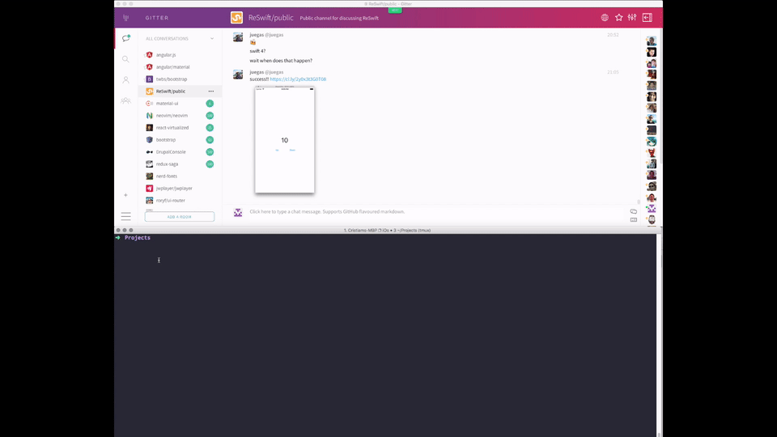

#ReSwift Counter Example - For Cocoapods Users

An extremely simple example app, built with [ReSwift](https://github.com/ReSwift/ReSwift).

## Modified Verson From Original

- i modified this from the original example because i was more comfortable with cocoapods
- https://github.com/ReSwift/CounterExample

## Installation

To install & run this app you will need to:

- Clone this git repository
- run `Pod install` in project directory

